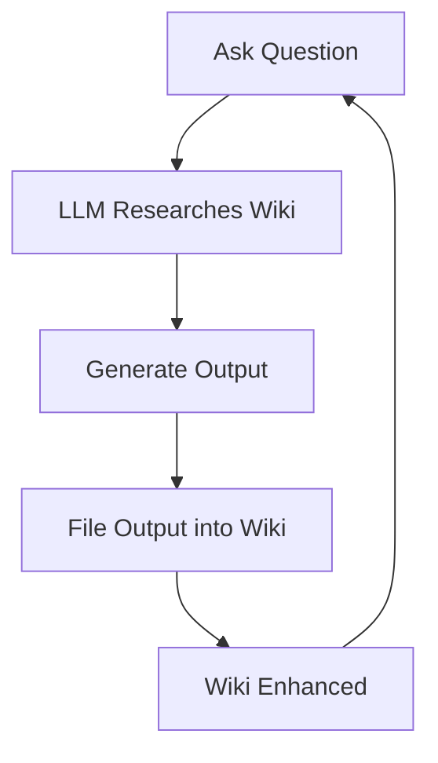

# Knowledge Feedback Loop

> Query outputs and explorations are filed back into the wiki, compounding the knowledge base over time.

## Overview

A distinguishing feature of the LLM knowledge base is that it grows not just from external sources, but from your own queries and explorations. When you ask the LLM a complex question and it generates an analysis, that analysis can be filed back into the wiki as a new article or connection. This creates a compounding effect where each session of Q&A enriches the base for future queries.

## Key Points

- Query results (analysis, slides, visualizations) become first-class wiki content
- The wiki captures both external knowledge (sources) and internal reasoning (your queries)
- Each Q&A session potentially improves the wiki's coverage and depth
- Health checks and linting further compound quality over time
- The knowledge base becomes a record of your intellectual exploration

## The Feedback Loop

## Related Concepts

- [[llm-knowledge-base]] — the system this loop enhances
- [[wiki-compilation]] — the process that integrates feedback

## Sources

- [[summaries/llm-knowledge-base-idea]] — describes the feedback loop pattern

