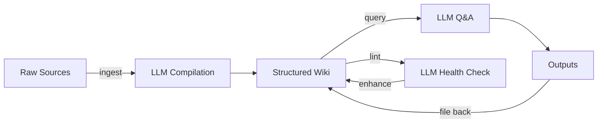

# LLM Knowledge Base

> A personal knowledge base where an LLM agent handles all creation, maintenance, and querying of structured content.

## Overview

An LLM Knowledge Base is a system where raw source materials (articles, papers, notes, images) are collected and then "compiled" by an LLM into a structured, interlinked wiki. The human's role shifts from manual note-taking to curating inputs and asking questions — the LLM does all the writing, linking, indexing, and maintenance.

This represents a fundamental shift in personal knowledge management: instead of tools like Notion or Roam where you write everything yourself, the LLM becomes the primary author while you become the editor and querier.

## Key Points

- The LLM is both the builder (compilation) and the query engine (Q&A)
- Raw sources are never modified — the wiki is a derived artifact
- The system compounds: query outputs feed back into the wiki
- Plain markdown files ensure portability and version control compatibility
- No custom infrastructure needed — just a directory of .md files and an LLM agent

## Workflow

## Scaling Considerations

- **Small scale** (~50 articles): LLM can read everything directly
- **Medium scale** (~100-500 articles, ~400K words): Index files enable efficient navigation
- **Large scale** (1000+ articles): May need search tools, chunking, or finetuning

## Related Concepts

- [[wiki-compilation]] — the process of turning raw sources into wiki articles
- [[index-over-rag]] — why plain-text indexes work at moderate scale
- [[obsidian-as-viewer]] — using Obsidian as the frontend
- [[knowledge-feedback-loop]] — how outputs compound the knowledge base

## Sources

- [[summaries/llm-knowledge-base-idea]] — original concept note

---
*Last updated: 2026-04-02*
*Tags: #llm #knowledge-base #core-concept*
